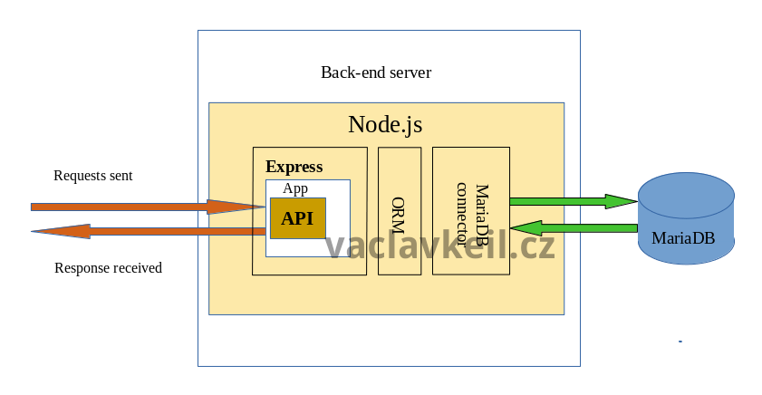

# REST API Express Node.js MariaDB ORM

This app implements REST API using Express and connects to MariaDB database
(Node.js, Express, MariaDB, ORM, create and read data)

## API Referencee

List Users: GET /users

Create a new record for Users: POST /users
@params
name {string}




## Installation: 

1) start MariaDB, create database ‚users‘, assign access rights for user ‚dbuser‘ (password ‚123456‘)
    ```bash
    $ sudo systemctl start mariadb
    $ mysql -u root -p
    MariaDB> CREATE DATABASE users;
    MariaDB> create user dbuser identified by ‘123456‘;
    MariaDB> grant select, insert, update, create, drop on users.* to dbuser;
    ```
2) install and run this app using  ‚npm i‘ and ‚npm start‘

## Sample API requests:

POST request using curl
```bash
$ curl -d 'name=Adam' http://localhost:3000/users
```

GET request using curl
```bash
$ curl http://localhost:3000/users
```
Please share your thoughts on how you will extend the given example and what are your apps based on it running on Fedora or any other open-source system.